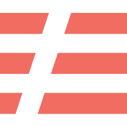

### Hi There 👋

#### I'm a Full Stack Developer and a Deep Learning Enthusiast from Mumbai, India 🇮🇳

 

 

 

  

---

- 👨‍💻 Software Engineer with [Freespace by Workplace Fabric](https://www.afreespace.com)
- 🌱 I’m currently exploring serverless technologies
- 💬 Talk to me about **system design**, **full stack development**, **flutter**, **deep learning** and **software development best practices**
- 📧 Reach me: [contact@ryandsilva.dev](mailto:contact@ryandsilva.dev)
- 🌟 Fun fact: I play 4 instruments 🎸🎹

---

<h3 align="left">Technologies</h3>

---

<h3 align="left">Latest Blog Posts</h3>

<!-- BLOG-POST-LIST:START -->
- [Trigger Events At A Specific Timestamp](https://levelup.gitconnected.com/trigger-events-at-a-specific-timestamp-2527f9336128?source=rss-7b93016e867c------2)
- [Easy Git Hooks for Flutter](https://blog.devgenius.io/easy-git-hooks-for-flutter-f2927cbbcfd4?source=rss-7b93016e867c------2)
- [What I Learned Working At StartUps…](https://blog.devgenius.io/what-i-learned-working-at-startups-1d856e677ef1?source=rss-7b93016e867c------2)
<!-- BLOG-POST-LIST:END -->
